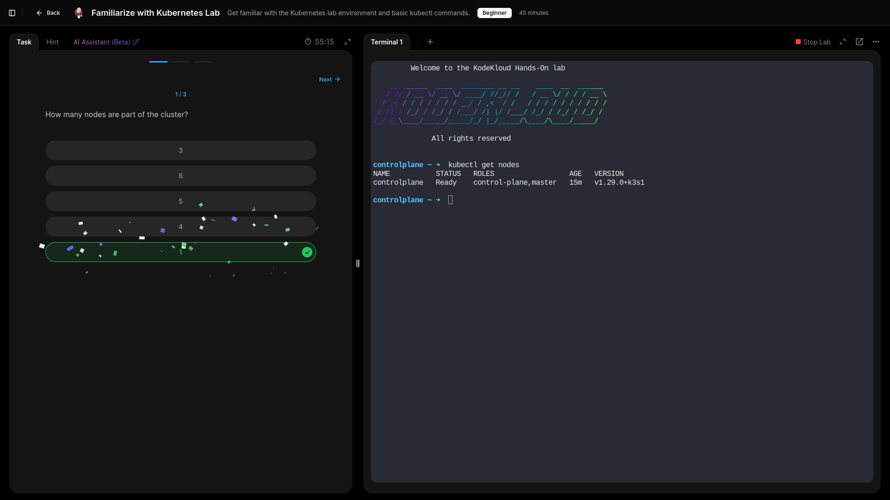
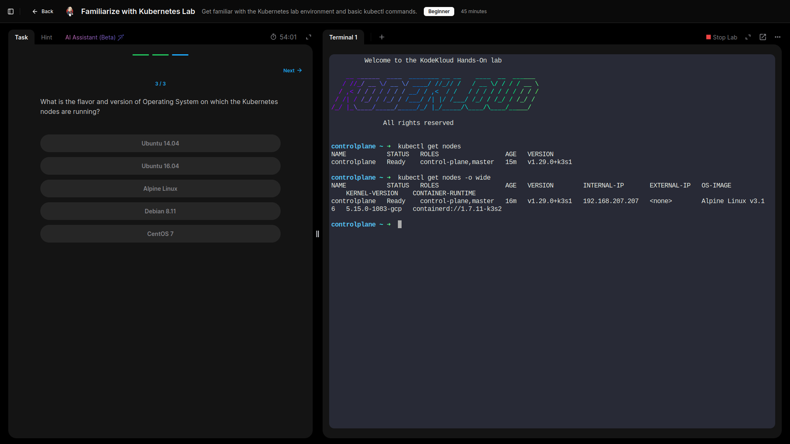
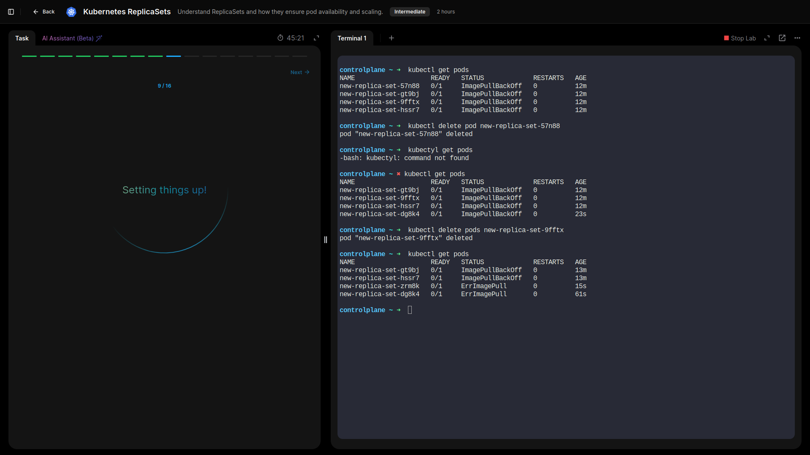
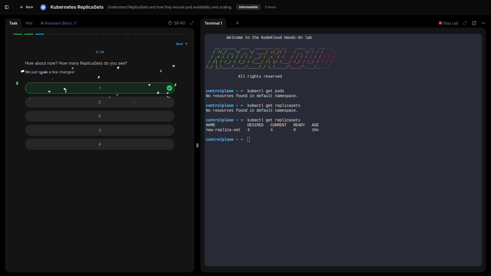
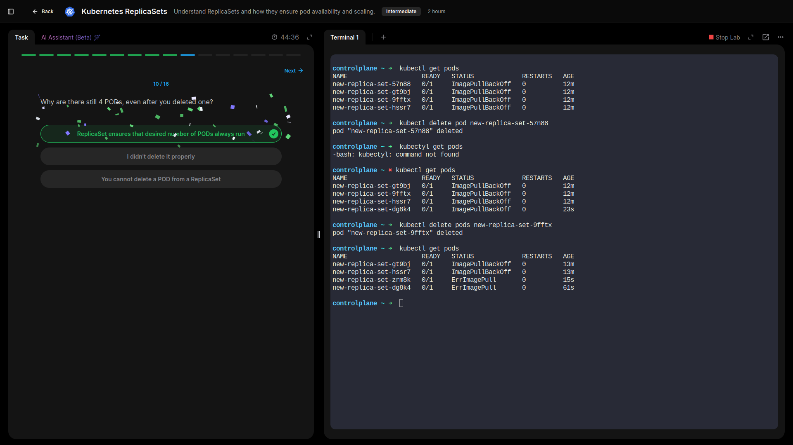
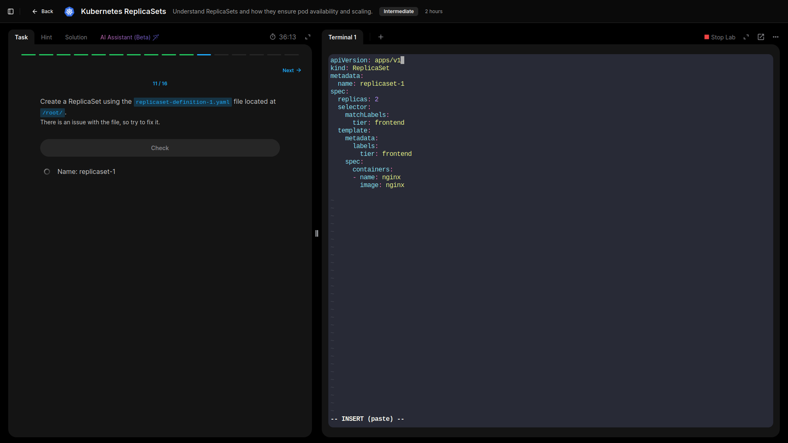
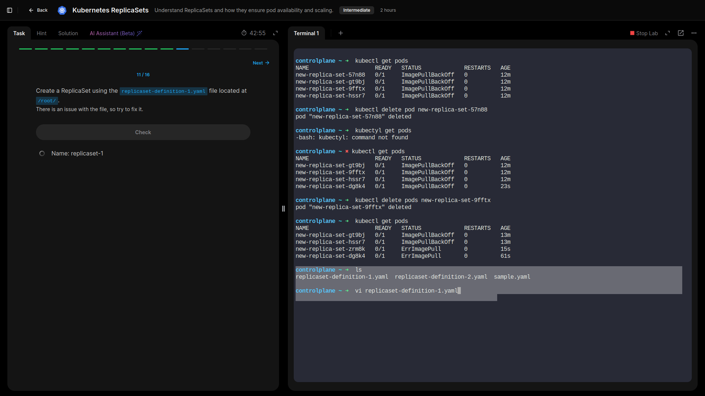
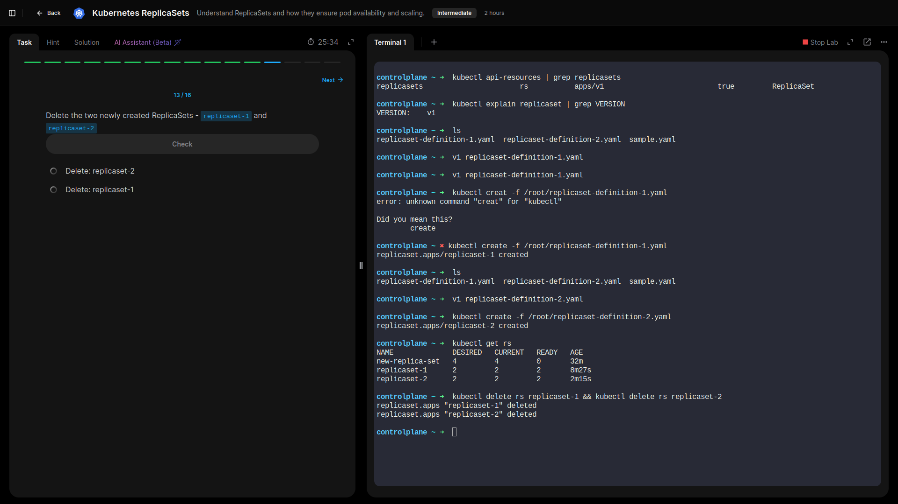

# Kubernetes Labs – Write-Up (Labs 1–3)

This document summarizes the first three Kubernetes labs completed on **KodeKloud**, highlighting objectives, lessons learned, and key Governance, Risk & Compliance (GRC) takeaways.

---

## Lab 1: Familiarize with the Kubernetes Environment

- **Explored the cluster layout and practiced essential `kubectl` commands, listed resources using `kubectl get` and examined node details with,**
  
  ```bash
  kubectl get nodes -o wide
  ```
- **Identified control-plane and worker nodes, gaining comfort with the CLI and cluster structure.**
   




---

## Lab 2: Pods

- **Learned that Pods are the smallest deployable units in Kubernetes.**

- **Created pods from existing images, verified images used to create a pod, as well as their status and assigned nodes (control plane or worker).**
  


- **Checked how many containers each pod contained and interpreted the READY column in kubectl get pods, identified a pod not running and reason why pod is not running.**

  
  


- **Deleted pods to observe lifecycle behavior.**

  
  




- **Intentionally deployed a pod with an invalid image, checked it's status, and then corrected it in place.**

  
  


---

## Lab 3: ReplicaSets

- **Inspecting existing ReplicaSets and their desired versus ready pod counts.**

  
 


- **Explored how ReplicaSets maintain high availability by ensuring a desired number of identical pods are always running by deleting pods deliberately and confirming that the replicaSet automatically recreated them.**

  
  


- **Fixing a manifest file and creating a functioning ReplicaSet from it to reinforce declarative configuration principles and deleting the created ReplicaSets.**

  
  




---

## GRC Key Takeaways

- **Trusted Images:** Always use container images from verified and reliable sources to reduce the risk of introducing vulnerabilities via compromised or unverified images. Implement image scanning and signing where possible to ensure integrity and compliance with organizational security policies.

- **High Availability:** Configure ReplicaSets with sufficient replicas to maintain uninterrupted service and reduce downtime. Ensuring the desired number of pods are running at all times supports business continuity and aligns with operational risk management practices.

- **Resource Monitoring:** Continuously monitor CPU and container performance to detect abnormal behavior or resource bottlenecks early. Proactive monitoring helps mitigate operational risks, ensures workloads remain performant, and supports compliance with service-level agreements (SLAs).

- **Least Privilege:** Avoid running nodes or containers as root to minimize the attack surface and reduce the potential impact of a security breach. Implement role-based access control (RBAC) and container security best practices to enforce the principle of least privilege across the cluster.

- **Configuration Management:** Maintain manifest files under version control and follow structured change-management processes. Accurate and auditable configuration management reduces the risk of misconfigurations, supports reproducibility, and ensures compliance with internal and external regulatory standards.


---


## Lessons Learned

- **Proficient `kubectl` Usage:** Gained confidence using `kubectl` commands to inspect cluster resources, view node and pod details, and troubleshoot issues. Learned to create, edit, and delete resources effectively, which is crucial for day-to-day cluster management.

- **Pods as Fundamental Workloads:** Understood that Pods are the smallest deployable units in Kubernetes and can host multiple containers. Learned to check container states, interpret the READY column, and manage pod lifecycles, including handling failures and image errors.

- **ReplicaSets for High Availability:** Learned how ReplicaSets automatically maintain the desired number of pods, replacing failed pods and scaling workloads as needed. Observed firsthand how deleting pods does not affect overall availability, reinforcing the concept of self-healing.

- **Importance of Accurate YAML Manifests:** Experienced how misconfigured manifests (e.g., invalid container images) can prevent pods from starting. Learned to validate, edit, and apply YAML manifests correctly to ensure reliable deployments, updates, and consistent cluster state.

- **Node Awareness:** Recognized how pods are scheduled onto either control-plane or worker nodes, emphasizing the importance of understanding node roles for workload placement, resource allocation, and cluster planning.

- **Troubleshooting and Debugging:** Developed a systematic approach to identify and resolve common issues such as pod readiness problems, failed container images, and incorrect manifests, which is essential for maintaining cluster stability.

---

