# Kubernetes Labs – Write-Up (Labs 1–3)

This document summarizes the first three Kubernetes labs completed on **KodeKloud**, highlighting objectives, lessons learned, and key Governance, Risk & Compliance (GRC) takeaways.

---

## Lab 1: Familiarize with the Kubernetes Environment
Explored the cluster layout and practiced essential `kubectl` commands.  
- Listed resources using `kubectl get` and examined node details with
  
  ```bash
  kubectl get nodes -o wide
  ```
- Identified control-plane and worker nodes, gaining comfort with the CLI and cluster structure.


---

## Lab 2: Pods

Learned that Pods are the smallest deployable units in Kubernetes.

  Key tasks:

- # Created pods from existing images, verified images used to create a pod, as well as their status and assigned nodes (control plane or worker).
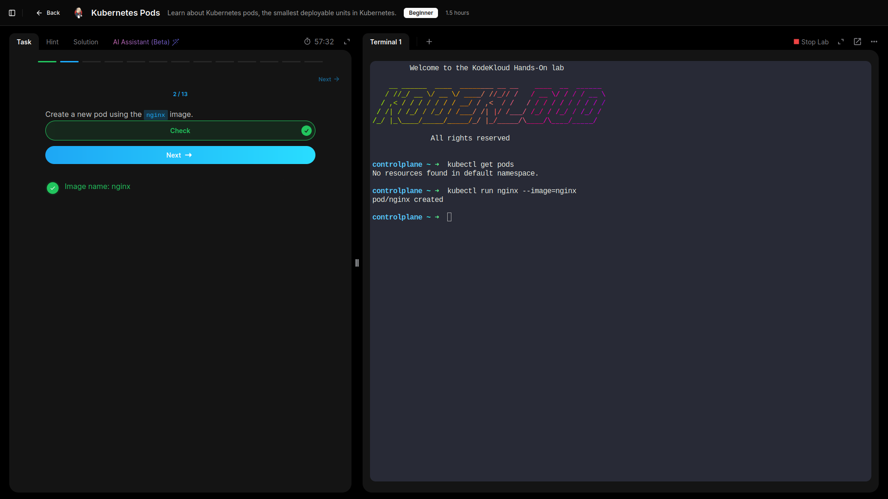
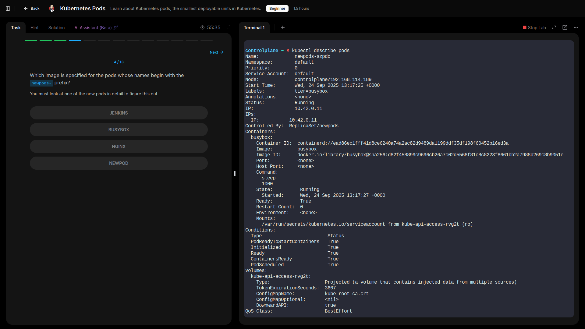
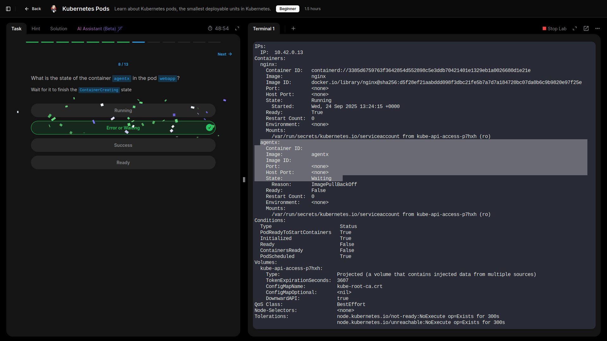
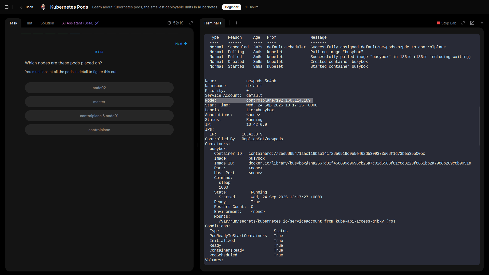


- # Checked how many containers each pod contained and interpreted the READY column in kubectl get pods, identified a pod not running and reason why pod is not running.
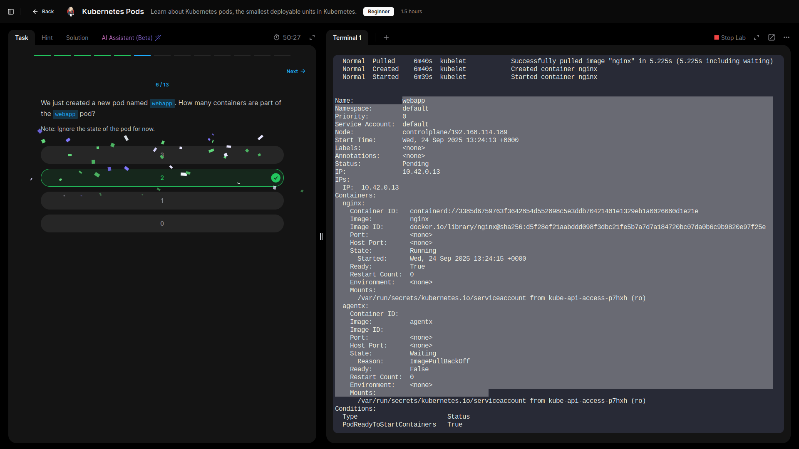
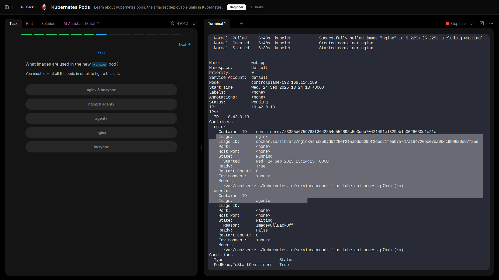
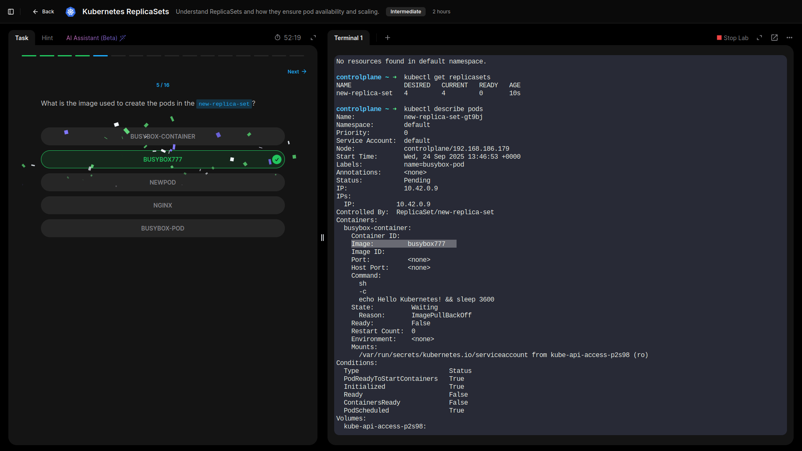
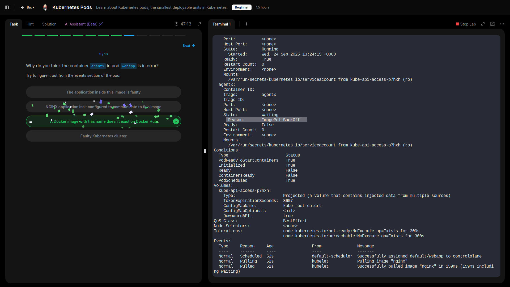


- # Deleted pods to observe lifecycle behavior.
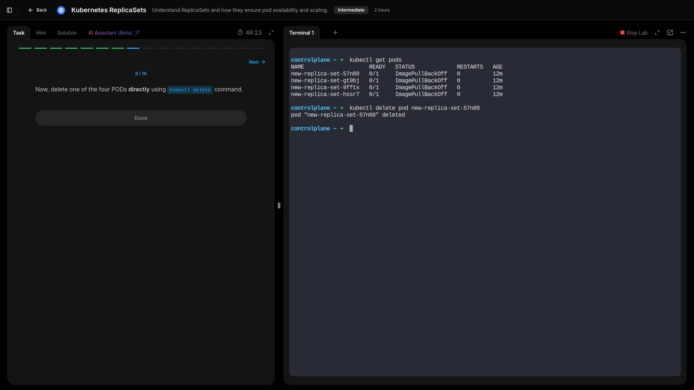


- # Intentionally deployed a pod with an invalid image, checked it's status, and then corrected it in place using:
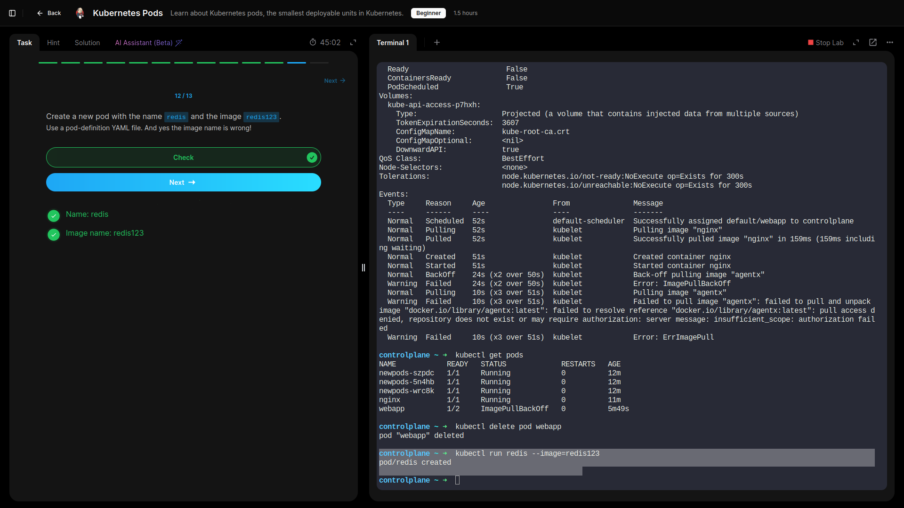
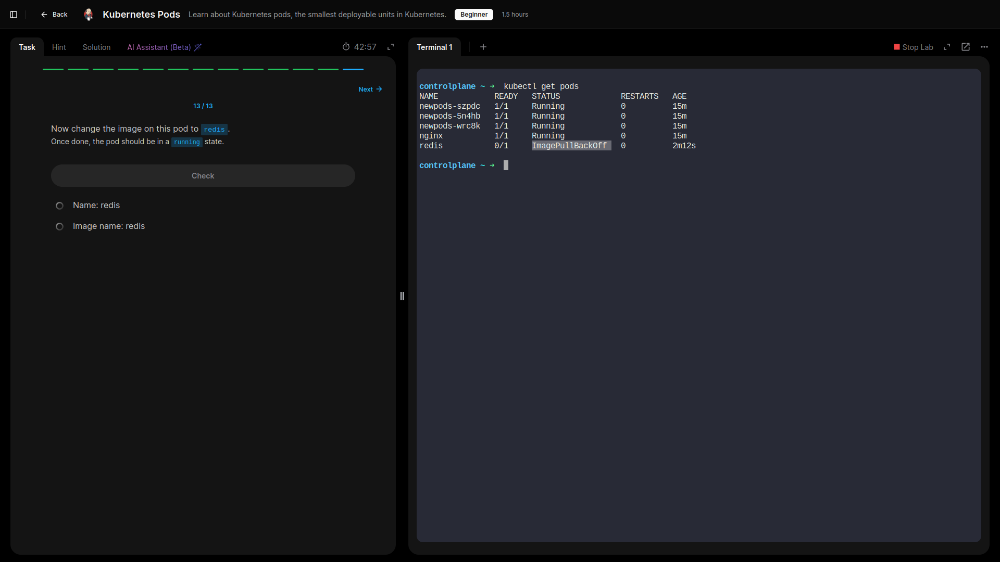
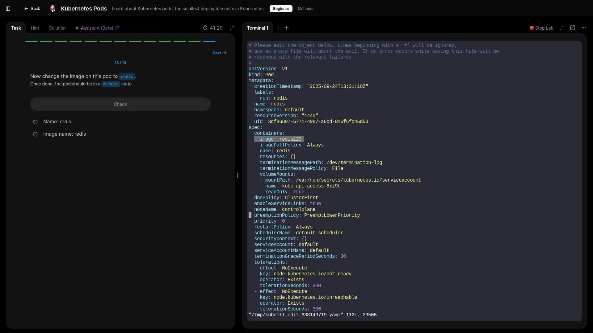
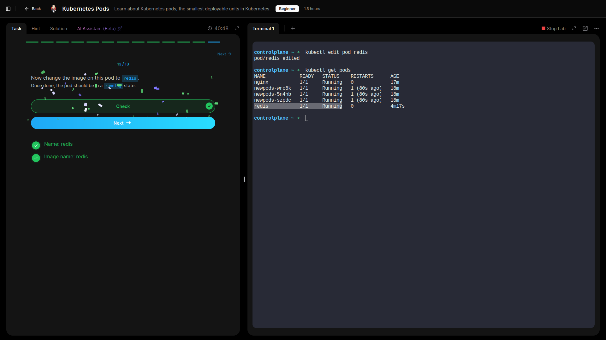
