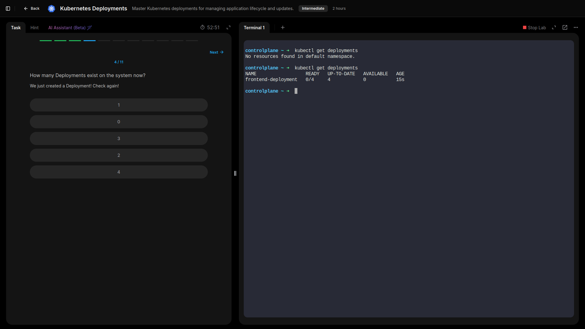
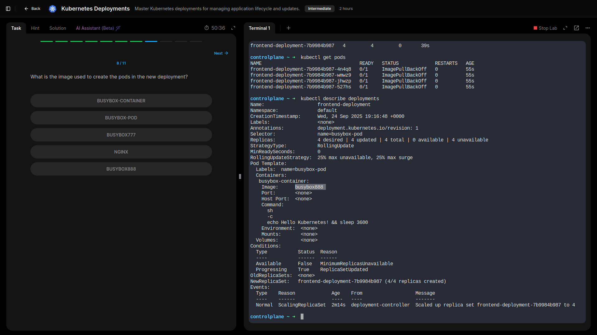
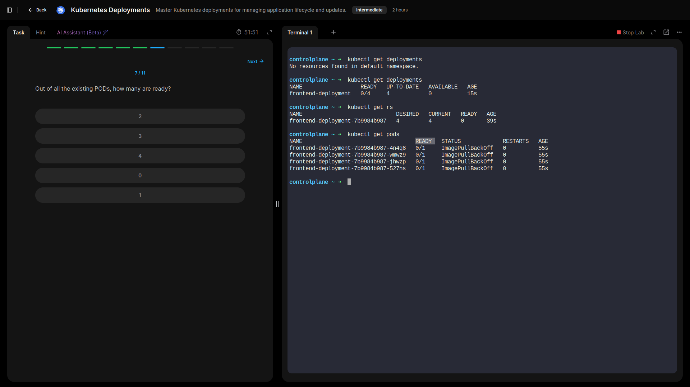
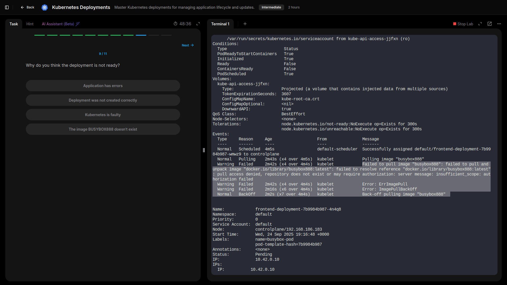
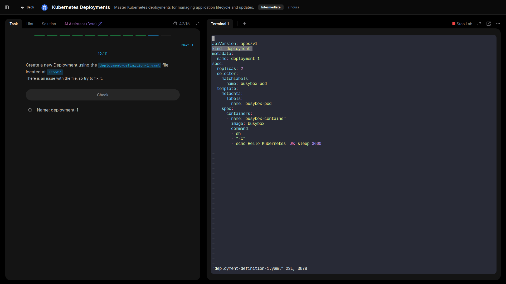
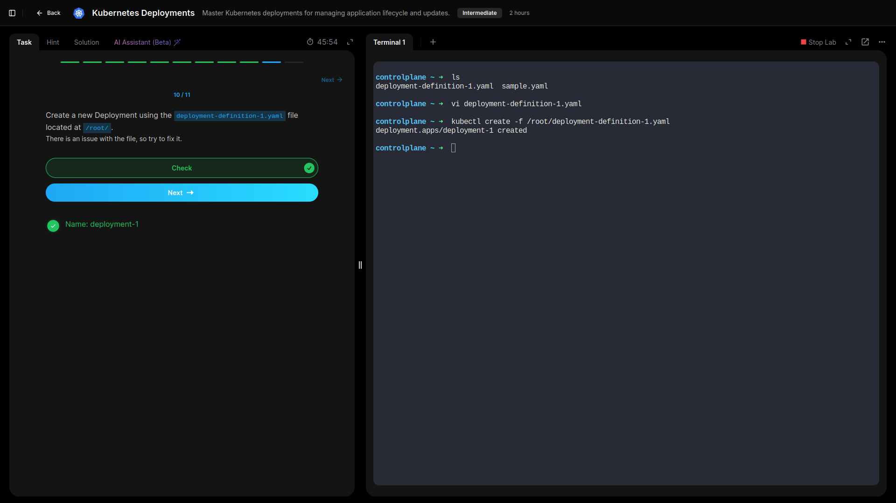
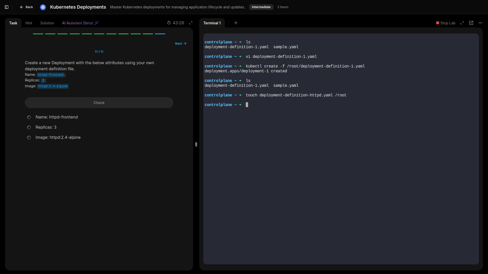
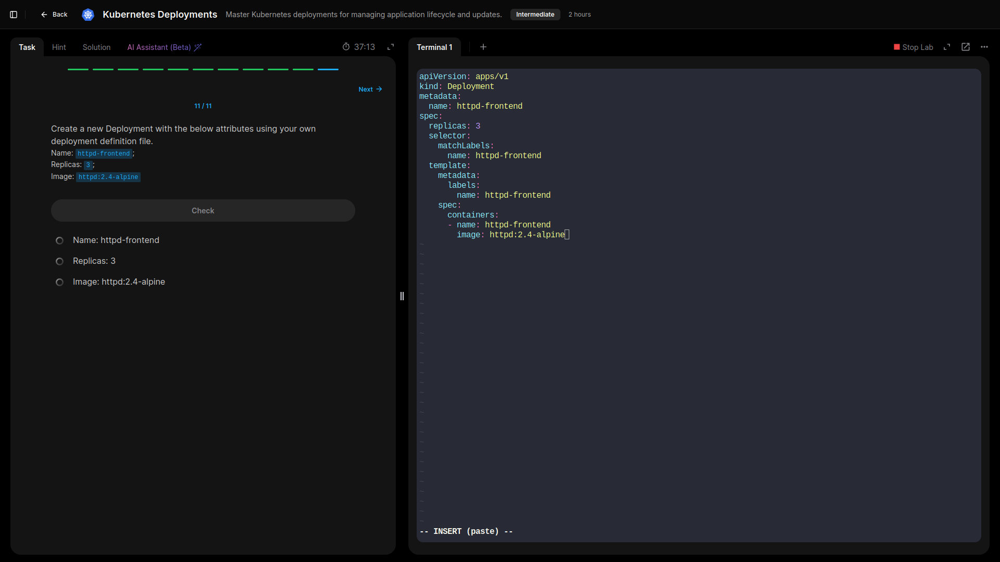
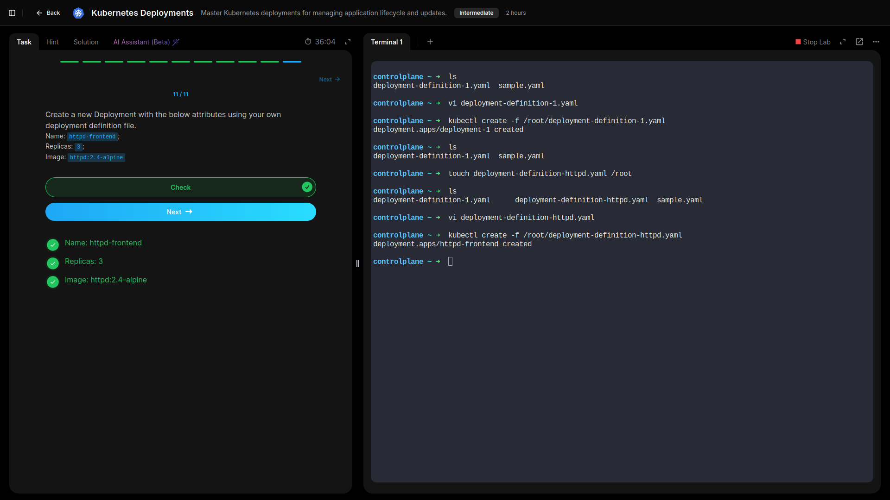

## Lab 4: Deployments

- **Explored existing Deployments, ReplicaSets, and Pods in the cluster to understand how Deployments manage application lifecycles.**  

  ```bash
  kubectl get deployments
  kubectl get replicasets
  kubectl get pods
  vi /root/path_to_manifest_file.yaml
  kubectl create -f /root/path_to_manifest_file.yaml
  
- **Verified the number of ready pods and inspected the container images used by each Deployment to confirm correct configurations.**

  




- **Investigated a Deployment that was not reaching the Ready state, identified the root cause, and applied a fix to ensure all pods became healthy.**

  




- **Created a Deployment from an existing manifest file that initially contained an error, corrected the manifest, and successfully applied it to the cluster.**

  



  


- **Built a new Deployment from scratch using the provided specifications, including image, replica count, and labels, to reinforce declarative configuration skills.**

  





