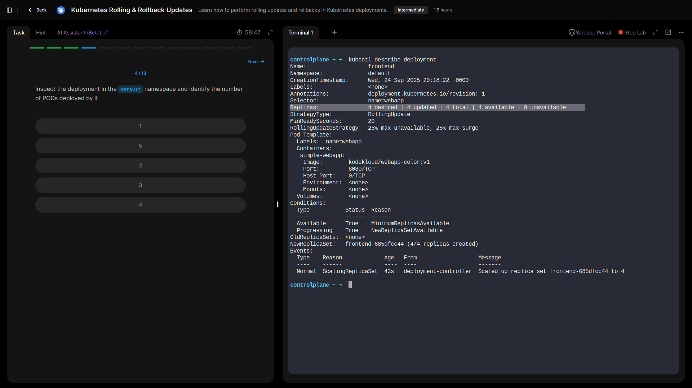
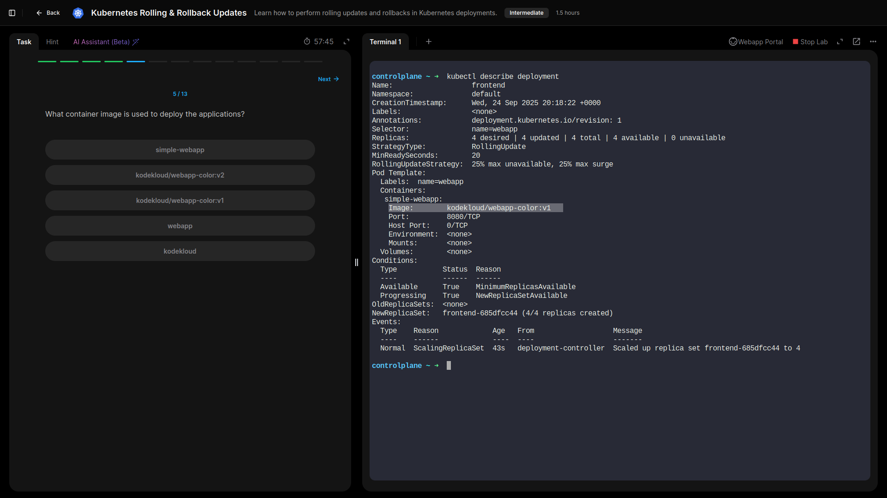
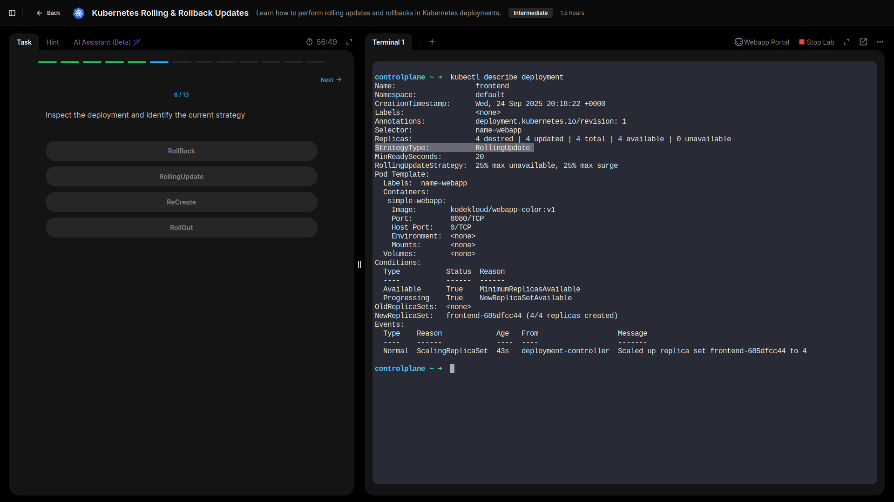
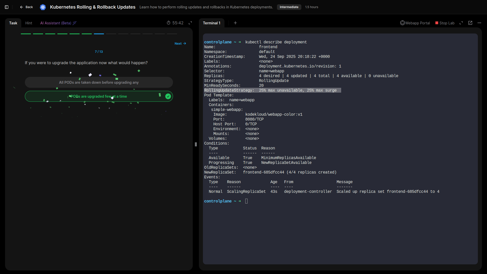
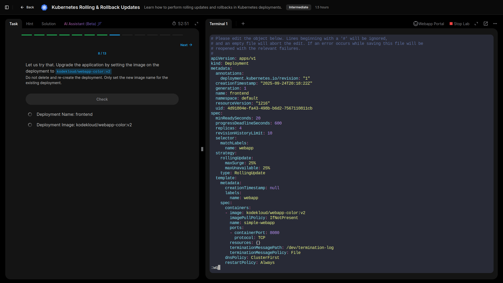
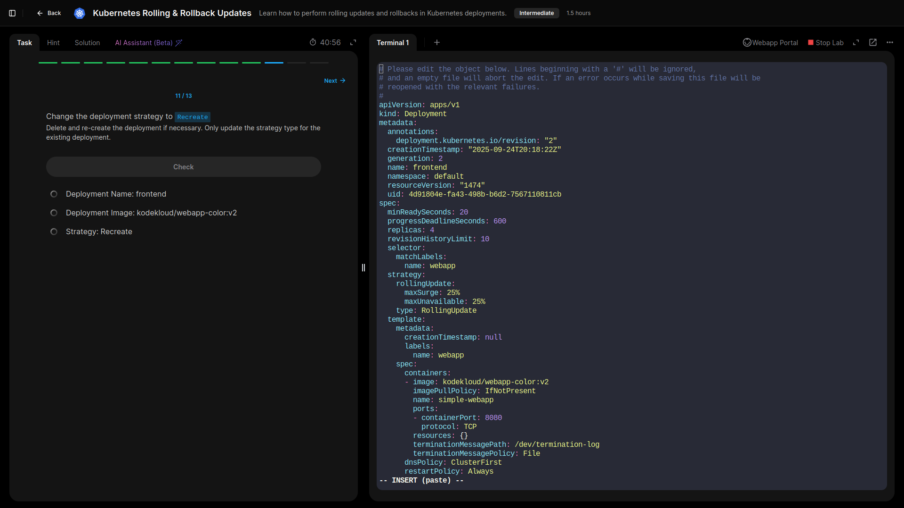
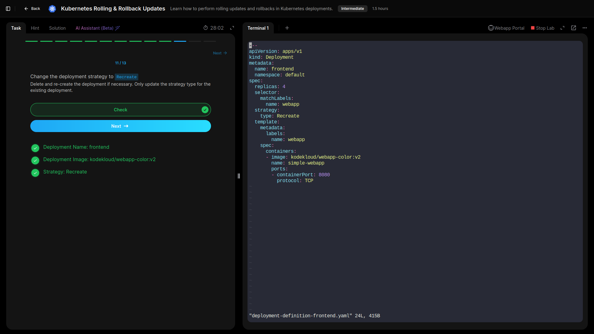

## Lab 5: Kubernetes Rolling & Rollback Updates

- **Inspected an existing Deployment and identified the number of pods  managed by it.**

  ```bash
  kubectl get deployments
  kubectl get pods
  kubectl edit deployments <name_of_deployment>
  ```


  
- **Checked the container image used by the Deployment and verified the current deployment strategy.**



- **Learned that rolling updates upgrade pods incrementally, typically updating a percentage (e.g., 25%) at a time, so one pod can be temporarily down without affecting overall availability.**


- **Updated the existing Deployment image using kubectl edit deploy <deployment-name> to apply a new version.**



- **Changed the deployment strategy from RollingUpdate to Recreate.**



---

## GRC Key Takeaways

- **Controlled Rollouts: Rolling updates reduce operational risk by updating pods gradually, preventing complete downtime and minimizing impact on end-users.**
- **Change Management: Using kubectl edit and version-controlled manifests ensures updates are auditable and aligned with organizational change policies.**
- **High Availability & Resilience: Incremental pod updates maintain service continuity, which supports business continuity and reduces exposure to downtime-related risks.**
- **Configuration Accuracy: Correctly specifying deployment strategy (RollingUpdate vs Recreate) is crucial for predictable updates and compliance with operational standards.**
- **Monitoring & Validation: Continuous monitoring during updates ensures deployed pods are healthy, images are correct, and deployment policies are followed, reducing the likelihood of misconfigurations.**

---

## Lessons Learned

- **Incremental Updates: Gained hands-on understanding of how rolling updates maintain service availability by upgrading pods in controlled batches.**
- **Deployment Strategies: Learned the difference between RollingUpdate and Recreate strategies, and when to use each in real-world scenarios.**
- **Live Configuration Edits: Practiced using kubectl edit deploy to make immediate changes, reinforcing the importance of validating updates before applying them.**
- **Risk Mitigation: Observed how careful update strategies reduce operational risk, maintain uptime, and align with compliance best practices.**
