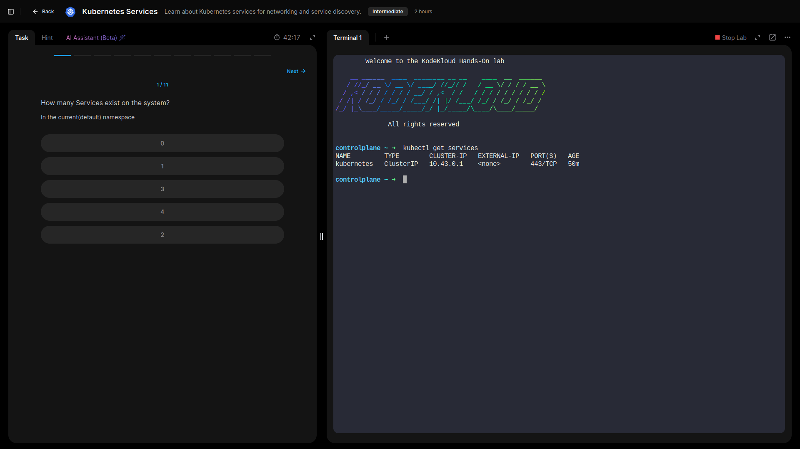
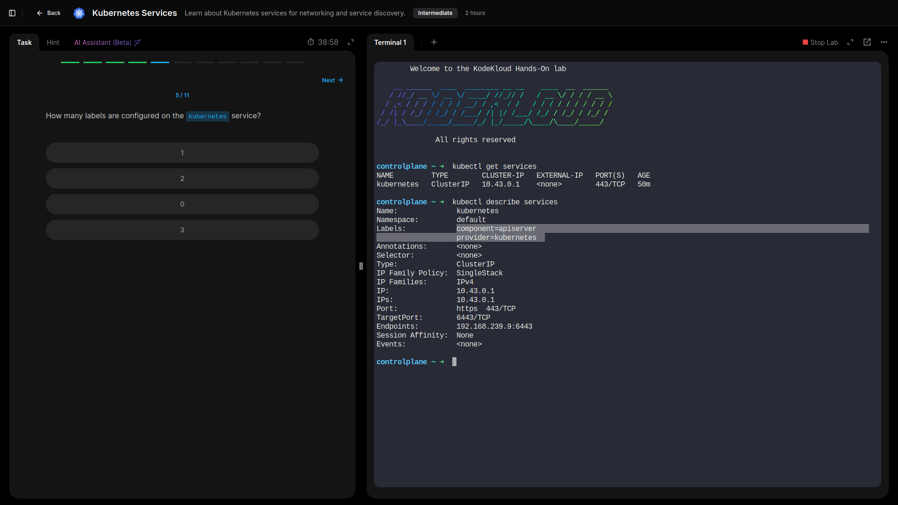
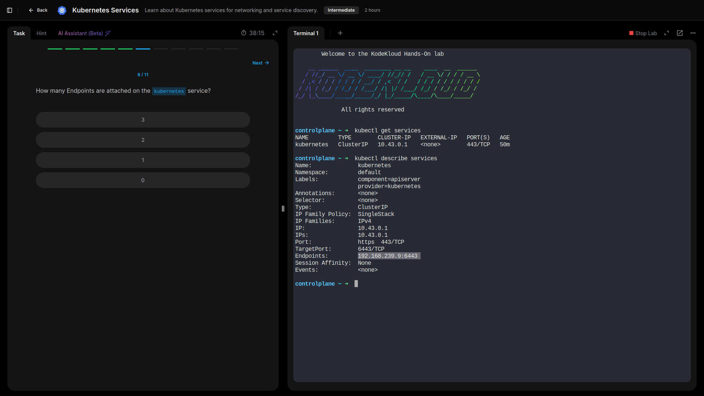
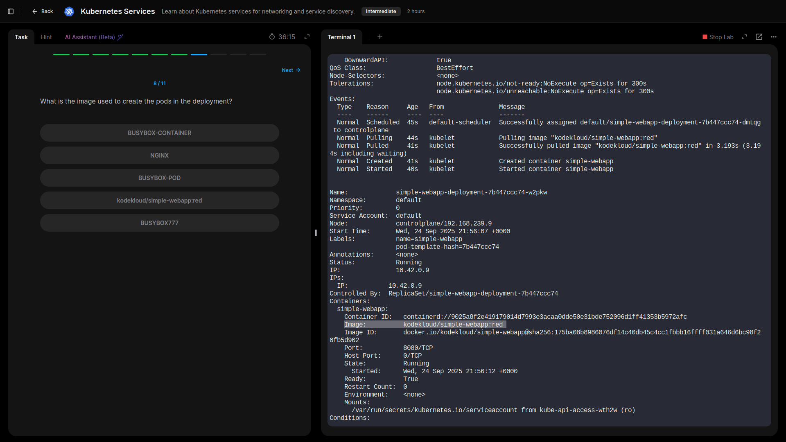
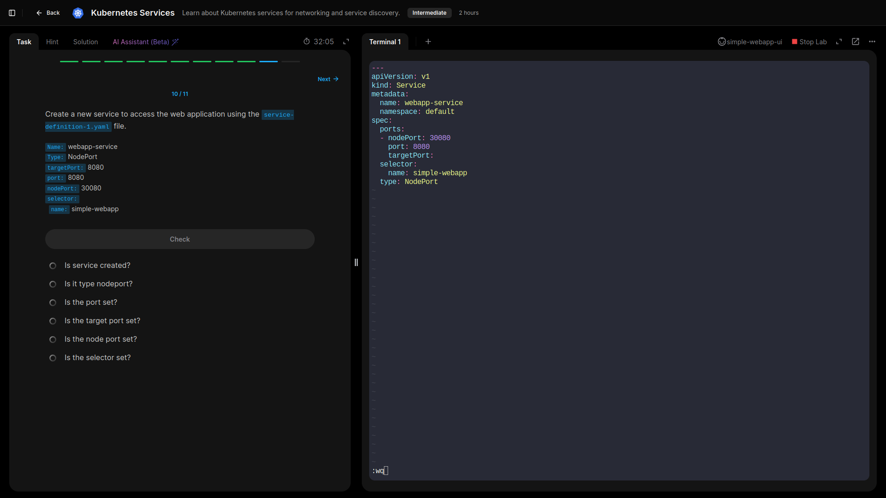
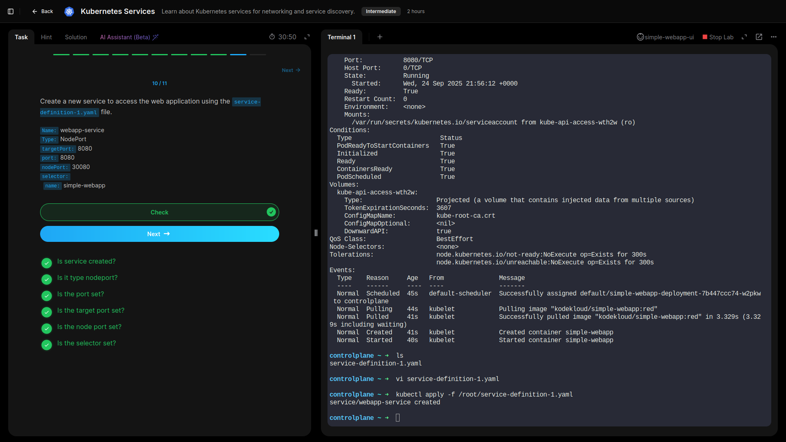

## Lab 6: Kubernetes Services

- **Inspected existing Services in the cluster and observed that the default type is `ClusterIP`.**

  ```bash
  kubectl get services
  kubectl describe service <service-name>


- **Checked the target ports and verified labels and endpoints used by Services to ensure proper pod selection and routing.**



- **Reviewed the images used by pods in the corresponding Deployment to confirm that the Service routes traffic to the correct workload.**



- **Created a new Service from an existing manifest file, configured it appropriately, and successfully accessed a simple web application through the Service.**




---


## GRC Key Takeaways

- **Network Security & Segmentation:** Using `ClusterIP` Services by default reduces the attack surface by limiting exposure of pods to internal traffic only.  
- **Access Control & Labels:** Properly configured labels ensure that Services route traffic only to intended pods, supporting operational compliance.  
- **High Availability:** Services abstract pod endpoints, allowing workloads to scale or fail over without affecting clients, which ensures service continuity.  
- **Configuration Management:** Creating Services via YAML manifests ensures reproducibility, version control, and auditability of network configurations.  
- **Monitoring & Validation:** Verifying target ports and pod labels ensures traffic reaches the correct pods, mitigating misconfiguration risks.  

---

## Lessons Learned

- **Service Types:** Gained hands-on experience with different Service types, starting with the default `ClusterIP`, and understanding their impact on accessibility and security.  
- **Pod-Selector Labels:** Learned how Services use labels to map traffic to pods, reinforcing the importance of correct label configuration.  
- **Manifest Application:** Practiced creating and applying Service manifests, including accessing the exposed application to validate functionality.  
- **Operational Reliability:** Observed how Services maintain access to pods even when the underlying Deployment scales or pods are replaced, highlighting abstraction and high availability.  
- **Configuration Discipline:** Reinforced best practices for consistent, version-controlled network configurations to support both technical reliability and compliance.
